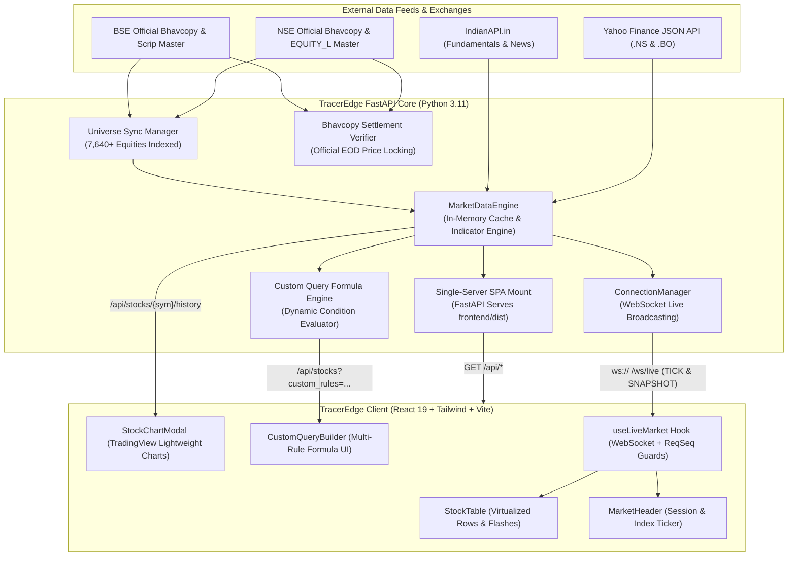
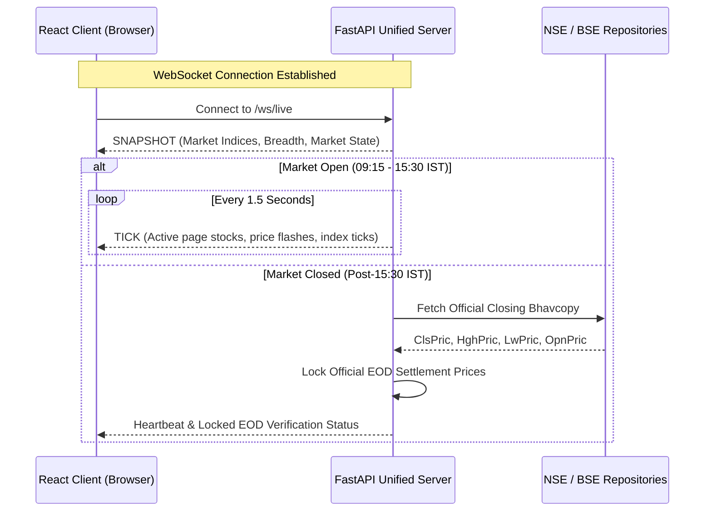

# 🏛️ TracerEdge Architecture & System Design

TracerEdge is engineered as an institutional-grade, low-latency equity screener and real-time streaming engine for the entire Indian stock market (**National Stock Exchange [NSE]** and **Bombay Stock Exchange [BSE]**).

This document details the system design, data ingestion pipelines, memory optimization strategies, and WebSocket streaming protocols.

---

## 1. High-Level System Architecture



---

## 2. Dual-Exchange Universe Architecture

Unlike screeners that track only large caps or conflate NSE and BSE listings, TracerEdge maintains an **independent, dual-exchange index**:

- **NSE Universe**: 2,587+ active equities with series tagging (`EQ`, `BE`, `SM`).
- **BSE Universe**: 5,053+ active equities with official 6-digit scrip codes (e.g., `#500325` for Reliance).
- **Dual Listings**: Symbols listed on both exchanges retain separate, non-colliding IDs (`RELIANCE:NSE` and `RELIANCE:BSE`) so price discovery, volume, and tick movements reflect the respective order books.
- **Continuous Synchronization**: The `UniverseSyncManager` queries official exchange repositories every 4 hours or on-demand via `POST /api/universe/sync` to incorporate newly listed IPOs and de-listed scrips.

---

## 3. Real-Time Streaming & Settlement Lifecycle



### Trading Session Logic
- **Session Hours**: Monday through Friday, 09:15 to 15:30 IST.
- **Market Open Mode**:
  - Live tick broadcast loop sends sub-second updates to connected clients.
  - Periodic background sync pulls live prices in multi-threaded batches.
- **Market Closed Mode**:
  - Simulated drift is disabled to preserve accurate closing levels.
  - Automatically fetches the official consolidated Bhavcopy from NSE and BSE to reconcile closing prices against official clearing settlement figures.

---

## 4. High-Performance Query Evaluation Engine

TracerEdge features a custom dynamic query engine (`data_engine.py:filter_stocks`) that evaluates user-defined comparison rules in microseconds across thousands of equities:

```python
# Rule structure evaluated dynamically:
{
    "left_field": "day_low",
    "operator": ">",
    "right_type": "field",        # "field" or "value"
    "right_field": "prev_high",
    "multiplier": 1.0,
    "tolerance_pct": 0.15
}
```

- **Supported Fields**: `day_low`, `day_high`, `open`, `price`, `prev_close`, `prev_high`, `prev_low`, `prev_open`, `volume`, `avg_volume_20d`, `rsi_14`, `ema_20`, `sma_50`, `sma_200`, `week_52_high`, `week_52_low`, `pe_ratio`, `market_cap_cr`.
- **Operators**: `>`, `>=`, `<`, `<=`, `==`, `!=`.
- **Float Equality Tolerance**: Numerical comparisons (`==`) apply a fractional tolerance percentage (default `0.15%`) to handle micro-tick float variances.
- **Combinators**: Support for boolean `AND` and `OR` logic chains.

---

## 5. Memory Optimization for Low-Memory Environments

Deploying high-concurrency Python applications on resource-constrained platforms (such as Render 512MB RAM free-tier instances) requires proactive heap management:

1. **glibc Heap Trimming**:
   In Linux, Python garbage collection frees objects, but the underlying C runtime (`glibc`) often retains memory in arena heaps. TracerEdge triggers `malloc_trim(0)` through `ctypes`:
   ```python
   import gc, ctypes
   gc.collect()
   try:
       ctypes.CDLL("libc.so.6").malloc_trim(0)
   except Exception:
       pass
   ```
2. **Environment Variables**:
   ```bash
   MALLOC_TRIM_THRESHOLD_=65536
   PYTHONMALLOC=malloc
   ```
   These settings instruct the memory allocator to release memory back to the operating system immediately after deallocation.
3. **Controlled Thread Concurrency**:
   Background quote enrichment uses bounded worker threads to prevent thread spikes and socket exhaustion.

---

## 6. Single-Server Production Architecture

In production, TracerEdge eliminates the overhead of managing separate web servers (Nginx + Node + Gunicorn):

- **Build Output**: The React frontend is compiled using Vite into `frontend/dist`.
- **FastAPI Mount**: FastAPI serves the pre-compiled static assets at `/assets` and provides a Single-Page Application (SPA) catch-all fallback to `index.html`.
- **Zero CORS / Same-Origin**: Both REST API endpoints (`/api/*`), WebSockets (`/ws/live`), and the HTML/JS application run under the exact same port (`8000`), eliminating CORS configuration headaches and reducing network hops.
